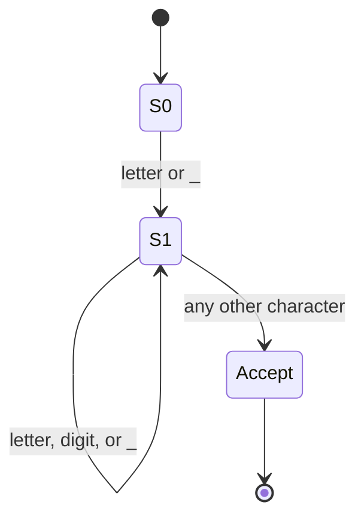
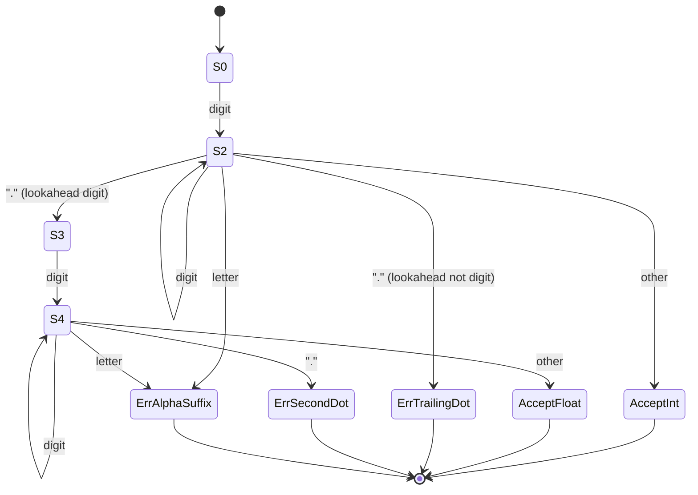
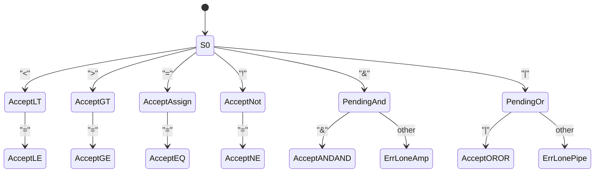

# Cascade — Token Classes & Scanner DFA Design

This is the design the hand-written scanner in `src/lexer.cpp` implements.
It's split into three independent automata rather than one giant DFA over
the whole alphabet, which is what `Lexer::tokenize()` does too: it looks
at the first character to decide which automaton to hand off to
(`scanIdentifierOrKeyword`, `scanNumber`, `scanOperatorOrPunctuation`),
then that automaton runs to a maximal-munch accept or error state.

Diagrams are Mermaid `stateDiagram-v2` blocks — GitHub renders these
inline in the repo, no extra tooling needed.

## 1. Identifiers & keywords

**Alphabet:** `letter = [A-Za-z]`, `digit = [0-9]`, `_`

```
State  | letter/_        | digit           | other
-------|-----------------|-----------------|-------------------
S0     | -> S1           | (not reachable  | -
       |                 |  from S0 here)  |
S1     | -> S1 (loop)    | -> S1 (loop)    | accept, emit token
```



**Post-processing (not part of the DFA itself):** once `S1` accepts, the
full lexeme is looked up in the keyword table (`int float if else while
true false`). A hit re-tags the token as the matching keyword; a miss
keeps it as `IDENTIFIER`. Doing the check after acceptance, rather than
building keywords into the automaton's states, is what gives maximal
munch for free — `iffy` runs all the way to `S1` before the lookup ever
happens, so it can never be mistaken for `if` followed by `fy`.

## 2. Numeric literals

**Alphabet:** `digit = [0-9]`, `.`, `letter` (only relevant for error
detection — a letter here always means the literal is malformed)

```
State  | digit        | .  (next=digit) | . (next=not digit) | letter        | other
-------|--------------|------------------|---------------------|---------------|-------------------
S0     | -> S2        | -                | -                   | -             | -
S2     | -> S2 (loop) | -> S3            | -> S_err_trail (dot,| -> S_err_alpha| accept INT_LITERAL
       |              |                  |    no fraction)     |               |
S3     | -> S4        | -                | -                   | -             | -
S4     | -> S4 (loop) | -> S_err_2dot    | -> S_err_2dot       | -> S_err_alpha| accept FLOAT_LITERAL
```

`S_err_trail`, `S_err_2dot`, and `S_err_alpha` are all error states: the
scanner keeps consuming characters (digits, dots, or alphanumerics as
appropriate) until it hits a real boundary, then emits one `LEX_ERROR`
token covering the whole malformed lexeme rather than splitting it into
several confusing tokens.



**Examples this design was tested against** (see
`tests/invalid_lexical.casc`):

| Input     | Path                              | Result |
|-----------|------------------------------------|--------|
| `42`      | S0→S2→S2→accept                    | `INT_LITERAL` |
| `3.14`    | S0→S2→S3→S4→S4→accept              | `FLOAT_LITERAL` |
| `12.`     | S0→S2→ErrTrailingDot                | `LEX_ERROR "12."` |
| `3.14.15` | S0→S2→S3→S4→S4→ErrSecondDot         | `LEX_ERROR "3.14.15"` |
| `12abc`   | S0→S2→ErrAlphaSuffix                | `LEX_ERROR "12abc"` |

## 3. Operators & punctuation

Single-character punctuation (`( ) { } ; ,`) and the single-character
operators (`+ - * / %`) accept immediately on one transition — there's no
ambiguity to resolve, so they're omitted from the diagram below for
clarity. The interesting states are the ones where a second character
changes the token entirely:



Every state without an outgoing arrow for the actual next character
falls back to accepting on the shorter token — e.g. `<` followed by
anything other than `=` accepts as `LT` right there, one character
behind. This is the standard "maximal munch with one character of
lookahead" shape, which is why `scanOperatorOrPunctuation()` only ever
needs `peek()`, never a second lookahead character.

`&` and `|` have no single-character meaning in this language (there's no
bitwise-and/or in scope), so a lone `&` or `|` is always a lexical error
— `ErrLoneAmp` / `ErrLonePipe` above — rather than a valid one-character
token.

## 4. Whitespace and comments

Not a token-producing automaton — handled by `skipWhitespaceAndComments()`
as a pre-pass before every token attempt. Space, tab, carriage return, and
newline are discarded; `//` runs to end-of-line and is discarded too.
Block comments (`/* ... */`) are not supported, matching the fact that
`/` only ever appears as the division operator or as the start of a line
comment in this design — worth flagging if the language grows.
